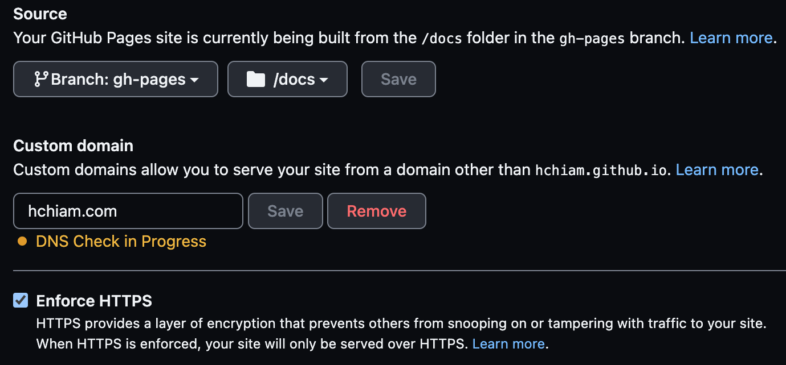

# [hchiam.com](https://hchiam.com)


Generated with [Astro](https://github.com/hchiam/learning-astro).

## One-time initial local setup

```bash
yarn # or npm i
```

(Don't have `yarn`? Try [installing `yarn`](https://yarnpkg.com/en/docs/install) and try again. Or [try replacing `yarn` with the `npm` equivalents](https://github.com/hchiam/learning-yarn).)

## Try it locally

```bash
yarn dev # http://localhost:3000
```

## Deploy to live sites

Simulate deploy locally:

```bash
yarn preview # http://localhost:3000
```

Then actually deploy:

```bash
# make sure you're in the main branch before you run this!
git pull
yarn deploy # https://hchiam.surge.sh and https://hchiam.com
```

You need to be in the `main` branch. This command should deploy and update the hchiam.com site. It should push a (modified) commit to the `main` branch and the `gh-pages` branch. GitHub pages should be set up to use the `/docs` sub-folder of the `gh-pages` branch.



## Suggested starting point to understand the code

`/src/pages/index.astro`
